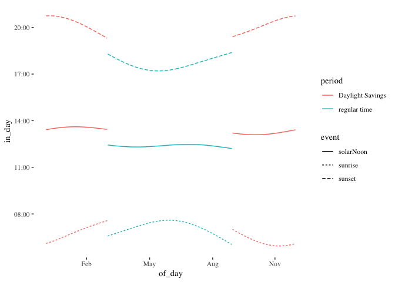

Note: For the code that calculated this out, see the README.Rmd file

### What does permanent summer time even mean

This "what would happen if we went to permanent summer time" piece uses Auckland as a reference point for two main reasons:

* Most people in favour seem to be in Auckland, so should probably be aware of what they are supporting.
* Auckland, being toward the north of the country, is a best case for what would happen. The effects are worse as you go further south.

We know from the [Attitudes and Values survey](https://cdn.auckland.ac.nz/assets/psych/about/our-research/nzavs/Feedback%20Reports/NZAVS-Policy-Brief-Regional-Commute-Times.pdf) that the average Auckland commute time is 5 hours a week, which averages two 30 minutes trips per workday. So it is reasonable to pick a leaving home time of 7:30 am.

For the winter time period, currently there are 41 days where sunrise is after 7:30am. In a state of endless summer time, this would increase to 163  lightless 7:30am starts to the day. However, we can assume most people are only commuting for 5 in every 7 days, so endless summer time would then be increasing the Stygian starts to the day from the present 29 work days to 116 Which is an increase of 87 work days, or around 4 bleak months.

So, about that more time in the evening

Because people may need to prepare and cook food before going out to enjoy the long summer evening, and cooking and eating dinner takes time regardless of the time of year, it seems reasonable to find how many days would permanent summer time shift the time of sunset to after 7:30 pm. This seems a reasonable time to get dinner out of the road and then go do natural light things.

The answer is that Auckland would gain zero more days of post 7:30 light with permanent summer time. Zero. Nil. Nada. The latest that sunset would be during the part of the year affected is 23 minutes (and 28 seconds) past seven pm. So the proposed bargain is to have near to 4 extra months of pre-dawn starts to the day in return for zero extra days of light in the evening.

But let's be charitable, and assume that you are an average Aucklander commuting home, and arriving home at about 6 pm, who also has no responsibility to partners or children to make sure to cook dinner (the people cooking dinner are mostly going to be inside with artificial lights available), so are wanting to do something outdoorsy under natural light. Or you actually want to have an after work barbecue type dinner. In winter. Putting aside, for the moment, all the people getting up before dawn to subsidise these events with their suffering, let's look at the practicality of these events in a notably pluvial country.

Instead of 7:30pm as a threshold, let's take "is light at 7pm" as a threshold for for having the time to do something outdoorsy for those that are free at 6pm and do not have household responsibilities. In return for fourish more months more of going to work before dawn, permanent summer time gives you 43 more days of light until 7pm.

But we can do a better analysis. Since we know the specific days, then of those 43 days, how often is it not raining at 6pm? Because if it is raining in winter (or late Autumn or early spring) most people would be indoors given the choice.
Checking [Cliflo](http://cliflo.niwa.co.nz) for hourly weather observations, the close to the centre of Auckland Albany station has about a decade of data. From checking sunset times, in all cases where there would be light at 7pm in endless summer (and not under daylight savings) the hour previous to sunset is 0600 UTC. This makes much less data we need to figure out if it would be raining in the gained time.

With 83.5% of 0600 UTC clear, the number reduces to an unpredictable 36 fine days among the 43. If we assume a perfect ability to predict and plan for which pre-7pm days are fine, that is still a lot of pre-dawn starts for those that get any benefit from endless summer time.

### What daylight savings actually does.

I think it is worth writing a postscript about what daylight savings actually does, as I didn't fully appreciate it until I did this analysis. We all, I sincerely hope, realise that there is more daylight in summer and longer nights in winter. For Auckland the difference is 14.7 hours of day in summer and 9.6 hours of day in winter. Because this extends and contracts around solar noon, both dawn and dusk get closer to noon in winter.

And here is the subtlety I had not full appreciated- when we spring the clocks forward, we are moving the clocks to synchronise better with what dawn is becoming over summer- pulling the human day back towards the much earlier dawn.

<!-- -->

So, this means that as daylight savings is happening as dawn is extending, it acts to regularise the way people (who get up at fixed time) experience dawn. It is, except for two days a year, a more constant relationship to the start of the day than it would be without daylight savings. For humans that get up at times set by the clock, daylight savings means that sunrise varies by 1.7 hours through the year, while sunset varies by 3.5 hours. All the getting things started circadian daily rhythms are better matched to the natural start of the day.

